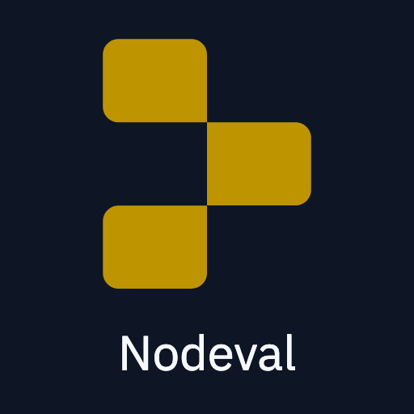

# Nodeval 🚀

Nodeval is a blazingly fast and bleeding edge Node.js script that allows you to connect your Replit Repl with your own computer. 

## 🔥Features

- 📁 Local file editing
- 🖥️ Command line access
- 🌐 Access your computer from the Replit IDE
- 🚀 Blazing fast performance
- 🆕 Bleeding edge technology

## Installation

Nodeval is easy to install! Just follow these simple steps:

1.  Clone this repository to your local machine
2.  Run `npm install` to install the required dependencies
3.  Run `node index.js` to start the Nodeval server

And that's it! Nodeval is now up and running on your local machine.

## Troubleshooting

If you have problems running Nodeval, please try to follow these steps:
1. Install [node-pty and its dependencies](https://www.npmjs.com/package/node-pty#Dependencies)
2. If this didn't fix the problem, feel free to [open an issue](https://github.com/lafkpages/Nodeval/issues/new).

## Contribution

Contributions are always welcome! Feel free to submit a pull request if you'd like to contribute to Nodeval.

## License

Nodeval is licensed under the GPL-3.0 License. See LICENSE for more information.
